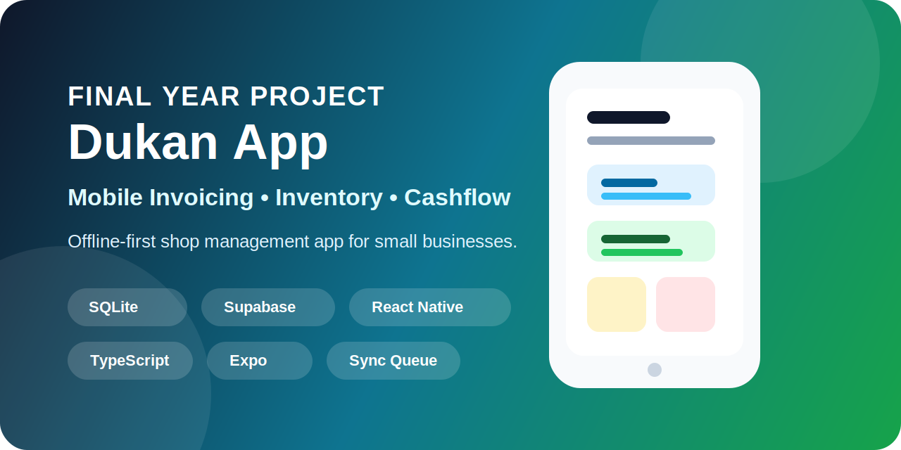

# Projects

<section class="projects-hero">
  
Selected work

  <h1>Projects that combine practical data thinking, reliable systems, and measurable business value.</h1>
  
These are my own projects, built to solve real business and academic problems through Python, SQL, databases, reporting workflows, and analytical problem solving. Each project reflects a different part of my technical approach: data analysis, operational automation, desktop applications, and structured reporting.

</section>

<section class="projects-list" aria-label="Project showcase">
  <article class="project-card">
    

      

        Python • SQLite • SQL
        Business Analytics
      

      <h2>DUKAN App</h2>
      
A business analytics and reporting system designed to reflect real retail operations, from sales and inventory to customer credit and operational oversight.

      

        <h3>What I built</h3>
        <ul>
          <li>Designed a structured database model for sales, inventory, customer credits, and reporting needs.</li>
          <li>Built SQL-based reporting workflows for invoice summaries, stock monitoring, and performance tracking.</li>
          <li>Created analytics modules that turn transaction data into usable business insights.</li>
          <li>Structured the system around practical reporting rather than simple record storage.</li>
        </ul>
      

      

        <h3>Impact</h3>
        
This project demonstrates my ability to build data-oriented systems that support day-to-day decision making, especially in retail-style environments where reporting and visibility matter.

      

      <a class="project-link" href="https://github.com/mian-arham-haroon/dukan-app" target="_blank" rel="noopener">View repository</a>
    

    

      

        

          
          App cover
        

        

          
          Dashboard
        

        

          
          Inventory
        

        

          
          Reports
        

      

    

  </article>

  <article class="project-card">
    

      

        Python • SQLite • Tkinter
        Desktop Application
      

      <h2>Inventory Management System</h2>
      
A desktop-based inventory control solution focused on stock tracking, CRUD workflows, and practical warehouse operations.

      

        <h3>What I built</h3>
        <ul>
          <li>Developed a relational SQLite database for inventory records and product management.</li>
          <li>Implemented full CRUD operations for adding, updating, deleting, and searching products.</li>
          <li>Built a Tkinter-based interface to make record management accessible and structured.</li>
          <li>Included workflow logic for tracking stock movement and maintaining consistent records.</li>
        </ul>
      

      

        <h3>Impact</h3>
        
This project highlights my ability to create operational tools that improve data organization and reduce manual handling of inventory information.

      

      <a class="project-link" href="https://github.com/mian-arham-haroon/Inventory-Management-System" target="_blank" rel="noopener">View repository</a>
    

    

      

        

          
          Main Interface
        

        

          
          Employee Management
        

        

          
          Product Management
        

      

    

  </article>

  <article class="project-card">
    

      

        Python • SQLite
        Academic Systems
      

      <h2>Student Management System</h2>
      
A database-driven application for managing student records, academic data, and structured information retrieval in a clear and scalable format.

      

        <h3>What I built</h3>
        <ul>
          <li>Created a database schema for storing student information and academic records.</li>
          <li>Implemented CRUD operations for student data management and record updates.</li>
          <li>Added search, filtering, and organization logic for navigating academic records efficiently.</li>
          <li>Designed the project around practical data handling for recurring administrative tasks.</li>
        </ul>
      

      

        <h3>Impact</h3>
        
This project reflects my approach to building reliable systems for data entry, organization, and long-term maintainability in academic settings.

      

      <a class="project-link" href="https://github.com/mian-arham-haroon/Student-Management-System" target="_blank" rel="noopener">View repository</a>
    

    

      

        

          
          Dashboard
        

        

          
          Records
        

      

    

  </article>

  <article class="project-card">
    

      

        Python • Pandas • Matplotlib
        Data Analysis
      

      <h2>Olympics Web Data Analysis Project</h2>
      
A data analysis project that turns Olympic datasets into structured insights through data cleaning, exploratory analysis, and visual storytelling.

      

        <h3>What I built</h3>
        <ul>
          <li>Cleaned and prepared Olympic datasets with Pandas for consistent analysis.</li>
          <li>Performed exploratory data analysis to uncover patterns across countries, sports, and performance.</li>
          <li>Created visual outputs using Matplotlib to communicate trends clearly.</li>
          <li>Focused on turning raw data into understandable analysis rather than surface-level summaries.</li>
        </ul>
      

      

        <h3>Impact</h3>
        
This project reflects my interest in analytical thinking, presentation of findings, and building insights from publicly available data in a way that is useful and interpretable.

      

      <a class="project-link" href="https://github.com/mian-arham-haroon/olympics-web" target="_blank" rel="noopener">View repository</a>
    

    

      

        

          
          Analysis 1
        

        

          
          Insights
        

        

          
          Trends
        

      

    

  </article>
</section>